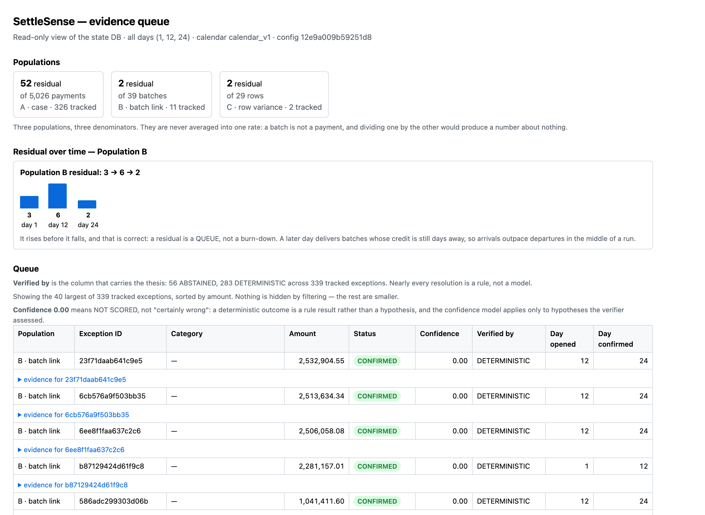
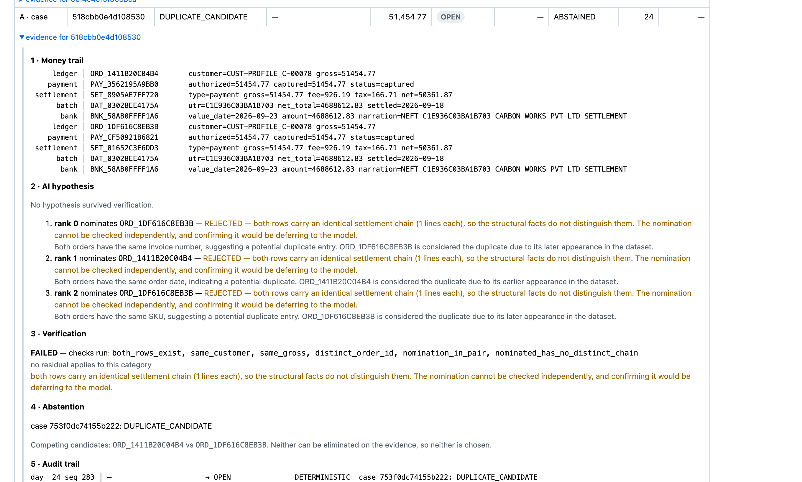
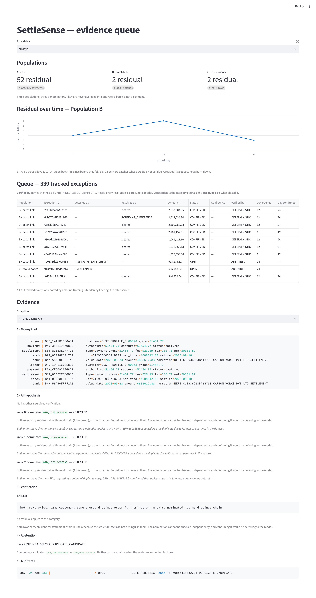
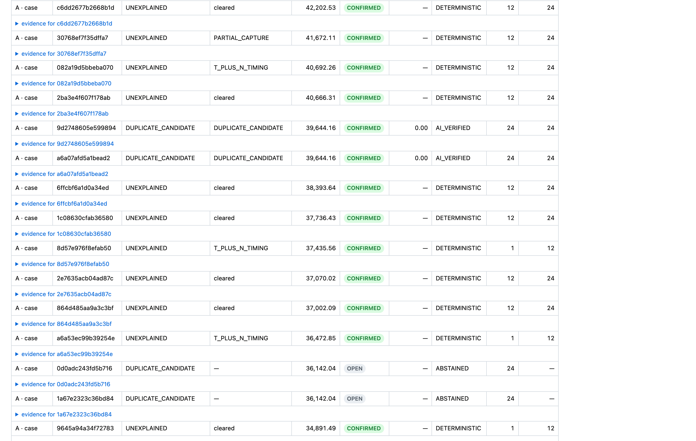
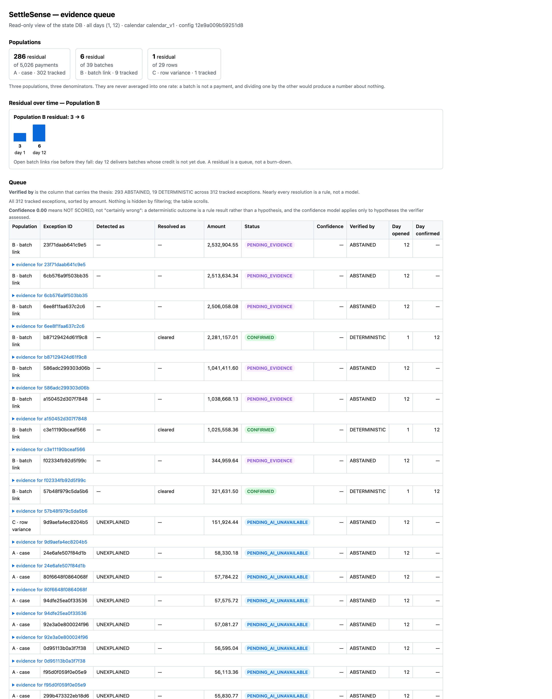
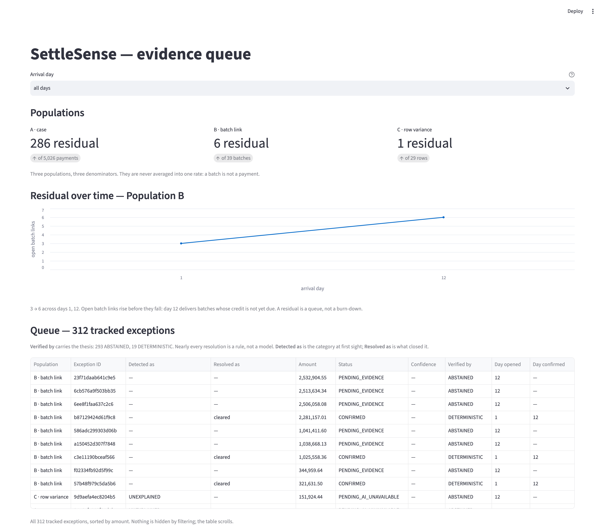

# Abstain — a settlement reconciliation agent that refuses to guess

The project is Abstain, and so is the repository —
[github.com/nandeshkanagaraju/Abstain](https://github.com/nandeshkanagaraju/Abstain),
renamed from `settlesense`. The Python package keeps that original name:
renaming it would invalidate the committed artifacts every published figure is
asserted against, so the package is `settlesense` deliberately, not as an
oversight.

## Results

**Three sets, three different rules, reported separately and never blended.**
A single combined figure would hide which one the engine was built against.

| Set | Seeds | Rule |
|---|---|---|
| **Dev** | 42 | Run freely while building. Tuned against — an upper bound, not a generalisation claim. |
| **AI evaluation** | 1000–1019 | Results may be inspected and the hypothesis loop adjusted — *that is what it is for*. What may not change is **which seeds are in it**. The range was declared before M7 and is never revised. |
| **Holdout** | 999 | **Run ONCE, at the end.** Recorded whatever it says. |

The AI evaluation set is **not** a second holdout. Iterating against it is
permitted and expected; the pre-registration constrains set membership, not
whether the results are looked at. The holdout is the only set with a
look-once rule, and it is the only one whose number carries an
untuned-generalisation claim.

### Dev set — seed 42 (`make eval`)

Built against. Inspected freely throughout M2–M5. These numbers are tuned-on
and should be read as an upper bound, not as a generalisation claim.

`as_of=2026-11-30` · `calendar_v1` · `config_hash=12e9a009b59251d8`

| Population A — `ReconciliationCase` (n=5,026) | |
|---|---|
| Case match rate | **0.989654** |
| Deterministic residual | **52** |
| Residual false-match rate | **0.000000** |
| Gross-exposure match rate (₹ `expected_gross`) | 0.989100 |
| Expected-net cash reconciled (₹ `expected_net`) | ₹72,204,883.74 |
| Unresolved expected-net cash | ₹800,722.94 |
| Evidence coverage | 1.000000 |

| Population B — batch↔bank links (n=39 batches) | |
|---|---|
| Batch link rate | **0.948718** (37/39) |
| Batch false-link rate | **0.000000** |
| Injected noise recovered | 15/17 · 0.882353 (0.875000 excluding the known truth defect) |
| Category precision on unresolved batches | 1.000000 (2/2) |

| Population C — row-grain variances (n=29 rows) | |
|---|---|
| Recall | **1.000000** |
| Precision | **1.000000** |
| Value | ₹1,330,088.02 |

Population A divides by payment count, B by batch count, C by row count. They
are three denominators and are never averaged together; `batch_net_total` is
not comparable to case `expected_gross`.

**All 52 residuals are one half of an ambiguous duplicate pair** — 26 pairs,
both halves flagged, because the engine cannot know which was injected. That
is the entire surface M7 has to work on, and it is deliberately not resolved by
rules: guessing would trade a zero false-match rate for coverage.

**Baselines — no ranking claimed.** The naive baseline links *fewer* here, but
that is one run on one dataset and is reported, not concluded.

| Baseline | Linked | False links | |
|---|---|---|---|
| `naive` | 32 | 0 | amount + date window only, no identifiers |
| `deterministic_only` | 37 | 0 | P1–P9, no model calls |
| `settlesense` | 37 | 0 | identical until M7 lands; reported so the AI delta is visible later |
| `llm_only` | — | — | **not run** — needs a recorded fixture set; never falls back to the network |

**Analyst time is a derived estimate, not a measurement**, and is attributed
separately: 4,974 deterministic resolutions × 4 min = 19,896 min. The AI layer
has resolved 0. The two are never added.

### The evidence queue (`make ui-static`)

Read-only over the state DB. Three populations in one table with the population
named per row, sorted by amount, and a **Verified by** column that carries the
whole thesis at a glance.

**Two category columns, not one.** `Detected as` is the category at first
sight; `Resolved as` is what closed it. A single column showed rows as
`UNEXPLAINED` + `CONFIRMED`, which reads as a contradiction — the category was
written at detection and never updated when a later day's file resolved it.
274 of 339 rows are in that position. Both facts are true and worth keeping, so
both are shown. Confidence renders as `—` on rule-resolved rows: it is a
property of the AI path, and `0.00` read as "no confidence".



**283 of 339 tracked exceptions say DETERMINISTIC.** The residual sequence
**3 → 6 → 2** rises before it falls, and the caption directly under the chart
says why rather than leaving a reviewer to assume a bug: *open batch links rise
before they fall — day 12 delivers batches whose credit is not yet due. A
residual is a queue, not a burn-down.*

Every row expands into the full evidence, in the order a reviewer needs it:



That is one real duplicate pair. The money trail follows **both** halves
end to end (ledger → payment → settlement → batch → bank, identical on both
sides — which is exactly why it is ambiguous). Below it are gpt-4o's three
**real** ranked hypotheses, each rejected by name, and the abstention reason
that 480 of 507 decisions share:

> both rows carry an identical settlement chain (1 lines each), so the
> structural facts do not distinguish them. The nomination cannot be checked
> independently, and confirming it would be deferring to the model.

`make ui` serves the same data through Streamlit — the interactive view, with
the residual chart pinned at a zero y-axis and labelled with real arrival days:



The two rows the AI layer resolved sit at ranks 58 and 59 by amount. The page
renders **all 339 rows** rather than the 40 largest — a table that reported
`2 AI_VERIFIED` in its caption and displayed neither of them was stating a fact
the reader could not check, and cropping to the interesting rows would have
been a selection:



### The two waiting states, side by side (`make ui-outage`)

`PENDING_EVIDENCE` means a file has not arrived. `PENDING_AI_UNAVAILABLE` means
the model is down. They call for opposite responses — wait, or go and find out
why — and until 2026-08-28 they rendered in **identical colours**, so an outage
looked like a normal queue. Day 12 is the one point in this run where both are
alive at once; by day 24 every waiting credit has arrived.



Six purple `PENDING_EVIDENCE`, three green `CONFIRMED`, and the blue
`PENDING_AI_UNAVAILABLE` rows below them — 285 of 312 after the simulated
outage. The Streamlit table draws to a canvas and carries no colour, so there
the distinction rests on the labels, which also differ:



**Both views are proved to agree, not asserted to.** `tests/test_view_parity.py`
extracts every displayed value from each renderer — all 339 rows × 10 columns,
plus each panel's ranked hypotheses, named checks, abstention reason and
competing candidates — and compares them field by field. An AST check forbids
either renderer from computing a category, amount, status or verdict of its
own, and a planted control tampers with one renderer and requires parity to
break. That guard exists because this divergence shipped twice: once on
evidence resolution for 333 of 339 rows, and once when the static page was
still calling the verifier itself while the README said it wasn't.

Each view states its own scope in the same words, and the sentence is COMPUTED
from the realised counts rather than written — both now render all 339, so both
say so. It said "the page shows the 40 largest" until the AI layer resolved two
rows ranking 58th and 59th; had the sentence been prose it would still say 40.
A table that does not say whether it is filtered is the wrong kind of ambiguity
in an honest exception list.

### Throughput — dev seed (`make bench`)

`arm · 8 cores · 8 GiB · Python 3.14.7 · macOS-26.6-arm64-arm-64bit-Mach-O`

**Median of 3 repetitions, never the best run.** No model calls. The machine
line above is captured automatically by M5a's `MachineSpec` and copied from
`reports/bench.md`'s header verbatim — `tests/test_bench.py` asserts the two
strings are identical, so a figure quoted here always names the machine that
actually produced it. Full table in [`reports/bench.md`](reports/bench.md).

| Records | Cases | Input rows | Pipeline (s) | Cases/s | Peak MiB |
|---:|---:|---:|---:|---:|---:|
| 500 | 502 | 1,626 | 0.041 | **12,269** | 1.8 |
| 5,000 | 5,026 | 15,779 | 0.356 | **14,118** | 19.4 |
| 25,000 | 25,123 | 78,594 | 2.057 | **12,215** | 94.9 |
| 100,000 | 100,506 | 313,869 | 9.078 | **11,072** | 379.7 |

Pipeline = ingest + engine; dataset generation is excluded from the timed
region and reported separately. 100k was **attempted and measured** because 25k
finished inside the two-minute budget that gates it — a skipped row would have
been absent, never extrapolated.

**Throughput holds within 20% across a 200-fold change in size** — 12,269 to
14,118 to 12,215 to 11,072 cases/s from 500 to 100,000 records. Roughly linear
scaling across four sizes is worth more than one impressive figure at one size,
which is why the small and large ends are both shown rather than the best row.

**Reading the files costs more than reconciling them.** Ingest is 52–67% of
pipeline time at every size measured; at the dev size, 0.239s of parsing
against 0.117s of matching. That is the reverse of what a reconciliation
system suggests, and it is where an optimisation would go — the matching
engine is not the constraint.

**Durations move between runs; nothing else does.** Across re-runs every count
above is bit-identical — cases, input rows, residuals, peak memory — while the
seconds and the rates derived from them vary by a few percent. That is the
expected shape: the pipeline is deterministic and the clock is not, which is
precisely why telemetry is a separate return value and never enters the result.
`tests/test_bench.py` cross-checks this table against `reports/bench.md` row by
row, so a stale README fails the suite rather than quietly misreporting.

**The residual share is the architectural argument.** The deterministic layer
carries the volume; the expensive stage is sized by ambiguity, not by rows:

| Records | Cases | Deterministic residual | Residual share |
|---:|---:|---:|---:|
| 500 | 502 | 4 | 0.80% |
| 5,000 | 5,026 | 52 | 1.03% |
| 25,000 | 25,123 | 246 | 0.98% |
| 100,000 | 100,506 | 1,012 | 1.01% |

Roughly one case in a hundred reaches the AI stage, and that ratio holds across
a 200-fold change in volume.

**Deterministic pipeline: 5,026 cases in 0.356s, zero model calls.** The AI
stage runs on the 52 residual cases — **1.03% of the workload** — of which 26
are AI-eligible duplicate pairs; the rest abstain without a model call at all.
Replayed from the recorded fixtures, those 26 decisions take **0.122s, 4.7 ms
each**, and cost **₹12.61 measured** — **₹0.80 per 1,000 rows** against PDD
7.3's ₹50 ceiling. **Model cost scales with ambiguity, not volume. Building the
rules layer properly is what keeps the expensive stage small.**

Two caveats a reviewer is entitled to, stated rather than buried. The 4.7 ms is
**cache-replay time, not API latency** — replay is what every test and every
`make eval` actually executes, but live latency was never captured because the
recorder took the API's token counts and read no clock. And the ₹0.80 names its
basis: the dev dataset's 26 pairs were recorded with **no sampling**, so ₹12.61
is the complete model spend for those 15,779 input rows.

**The pre-spend estimate was wrong, and not where it looks.** Before any model
was called, cost was projected at **₹40.98 per 1,000 rows** against the ₹0.80
measured — off by **51x**. But the pricing model was nearly right: it projected
₹0.4083 per decision against **₹0.4845 measured**, only 16% low. *The entire
error was the decision count* — it assumed 507 decisions per dataset where a
dataset of this size produces 26. Which is the architectural claim restated as a
costing bug: the deterministic layer had already removed the work the estimate
was pricing. Two independent recordings agree on the per-decision figure to
within 0.2% (₹0.4842 across 40 evaluation-set decisions, ₹0.4850 across 26
dev-seed ones), so the measurement is not a single lucky run.

Telemetry is a **separate return value** from the business result, not a field
inside it (SDD 8.1). `ReconciliationResult` contains no float, no duration and
no timestamp anywhere in its transitive type graph, so a golden comparator has
nothing to strip — and a test asserts the serialized result is byte-identical
with instrumentation on and off.

### AI layer — the verified hypothesis loop (`make eval-ai-loop`)

> **Of 507 duplicate-pair decisions the deterministic engine could not resolve,
> structural evidence exists for only 27. A real model (gpt-4o) nominated
> correctly on 33 of a 40-case sample and was confirmed on 20 of 20 where
> evidence existed, with zero false confirms. The remaining 480 have nothing to
> verify against — the two halves are structurally identical — and the system
> abstains, naming the check that failed.**

Both halves of that sentence matter and neither survives alone. The first is a
bound on the *data*: no model can be confirmed on a pair whose two rows are
indistinguishable, so 27 is a ceiling rather than a score. The second is what a
real model did inside that bound — and the fact that it was **rejected on the
other 20 of the sample, exactly as a perfect nominator is**, is the property the
architecture is for.

Measured across all **507 pre-registered decisions** (seeds 1000–1019) with
three stand-in clients and **no model calls at all**. Full table in
[`reports/ai/ai_loop.json`](reports/ai/ai_loop.json).

| Client | Nominates | Confirmed | |
|---|---|---:|---|
| **Oracle** | always the truth-correct row | **27 / 507** | the ceiling |
| **Adversarial** | always the *wrong* row | **0** | false confirms |
| **Silent** | nothing schema-valid | **0** | abstains, never crashes |

**27/507 is a ceiling, not a score.** No real model can exceed it: for the other
480 pairs the structural facts do not distinguish the two rows, so the verifier
rejects whatever is nominated. Reporting "the AI explained 5%" would report a
property of the *dataset* as though it were a property of a model.

**The adversarial zero is the safety result.** A verifier that rubber-stamped
would score identically on the oracle run — only an adversary that is always
wrong separates discrimination from deference. 480 decisions abstain with
`ALL_REJECTED`, and the reason names the check that failed.

Why the ceiling is so low is documented in [LIMITATIONS.md](LIMITATIONS.md):
the injected duplicate carries an invoice-number fingerprint that identifies it
perfectly and means nothing, and once that is excluded the two halves of a pair
are structurally identical.

**Provider:** OpenAI, pinned to the dated snapshot **`gpt-4o-2024-08-06`** —
never the moving `gpt-4o` alias, because a fixture recorded against an alias
cannot be reproduced once it repoints. `temperature=0`, `top_p=1`, `seed=42`.

**Determinism comes from the replay cache, not from the provider.** OpenAI
documents `seed` as best-effort. The provider settings reduce noise while
recording; the guarantee is the recorded response replayed byte for byte. The
provider is reachable from exactly one module, `eval/record_fixtures.py`, and
from nowhere in `settlesense/` at runtime.

### A real model in the loop — 40 recorded decisions

A stratified sample was recorded against the live provider: **20 the oracle
confirms, 20 it rejects**, chosen by a rule fixed in
`eval/record_fixtures.py` *before* any model was called, and stored in
`fixtures/llm_manifest.json` so the ordering is checkable. Scored in
[`reports/ai/real_model_sample.json`](reports/ai/real_model_sample.json).

| | |
|---|---|
| Produced a parseable hypothesis | **40 / 40** |
| Nominated one of the two rows | **40 / 40** |
| Decisive nomination correct | **33 / 40** |
| …its *top-ranked* guess | 24 / 40 |
| …on the confirmable stratum | **20 / 20** |
| Verifier confirmed — model | **20 / 40** |
| Verifier confirmed — oracle | 20 / 40 |
| **False confirms** | **0** |

**The model ties the oracle where evidence exists and is rejected everywhere
else.** On the 20 confirmable pairs it nominated correctly every time; on the
20 where the structural facts do not distinguish the rows, the verifier
rejected it — as it rejects a perfect nominator on those same pairs.

**Ranked hypotheses are not decoration.** The top-ranked guess is right 24/40,
but the nomination the verifier *acted on* is right 33/40 — because it tries
rank 0, 1, 2 in order and discards the ones that do not check out.

**Cost, MEASURED from the API response** (not estimated from prompt length):
24,996 input and 15,760 output tokens for 40 decisions = **$0.220090 (₹19.37)**,
which is **₹0.4842 per decision**.

*This previously read "about ₹2.49 per 1,000 rows".* That figure had no
derivation recorded anywhere in the repo and could not be reproduced from the
manifests, so it is replaced by the per-decision cost — which is what was
actually measured — plus a per-row figure whose basis is stated:
[₹0.80 per 1,000 rows](#throughput--dev-seed-make-bench), from the dev dataset's
26 pairs recorded with no sampling. Both are far under PDD 7.3's ₹50 ceiling;
the point of the correction is that a per-row cost is meaningless without the
row count it was divided by.

### Two AI measurements, on two paths, neither correcting the other

> **AI layer, dataset-derived decisions (M7): 507 decisions, 27 confirmable,
> zero false confirms.**
>
> **AI layer, persisted store path: 22 pairs replayed, 1 confirmed, 21
> abstained, zero false confirms. 3 residual rows had no partner and are
> excluded.**

The first is *the measurement*; the second is *the wiring proof*. They are
different paths over the same duplicates and both stand as recorded.
[`reports/ai/store_path.json`](reports/ai/store_path.json) (`make ai-store`).

The model named the truth-correct order in 14 of 22 store-path pairs. The
verifier confirmed one. The other 13 correct nominations were rejected because
the evidence could not carry the claim. Being right is not the same as being
provable — a system that confirmed every correct guess would also confirm the
wrong ones it could not tell apart.

**Why the second one exists.** `--simulate-outage` exposed that the AI layer had
never run against the exception store: M7 was measured over dataset-derived
pair exceptions, the store persists engine outcomes under hash ids, and the two
sets had zero ids in common. So no persisted row carried
`resolved_by = AI_VERIFIED`, and the queue read as an AI layer that existed only
in tests. It now shows **283 DETERMINISTIC and 2 AI_VERIFIED**.

**The pairing key, stated because it is a rule that changes which decisions get
made:**

> Store rows are paired at read time on (gross amount, settlement batch). This
> nominates candidates only; the verifier still decides from evidence.

Nothing is persisted — the join is computed when the stage runs and discarded —
so **no Population A/B/C denominator moves**: 5,026 / 39 / 29 before and after,
with the same 326 / 11 / 2 persisted rows. Population A's *residual* drops
52 → 50, which is the two rows the AI explained.

**The result worth reading is the gap between right and provable.**

| Store path, 22 pairs | |
|---|---:|
| Model produced a hypothesis | 22 / 22 |
| Nominated the truth-correct order | **14 / 22** |
| **Verifier confirmed** | **1** |
| **False confirms** | **0** |

The model named the right order 14 times and the verifier confirmed **one**. The
other 13 correct answers were rejected — `ALL_REJECTED`, meaning the verifier
looked and the evidence could not support the claim. Being right is not the same
as being provable, and a system that confirmed every correct guess would also
confirm the incorrect ones it could not tell apart. The single confirmation is
checked against truth and is correct.

**Zero was spent.** All 22 prompts were already in `fixtures/llm/` from the M7
recording session — the store's pairs and the dataset's pairs describe the same
duplicates. The gap was a read-time join, not missing recordings. A 47-row
recording against the live model was considered and **not** done; see
[LIMITATIONS.md](LIMITATIONS.md) for the measurement that ruled it out.

### Held-out set — seed 999 (`make eval-holdout`)

**RUN ONCE, on 2026-08-27, after M8. Nothing was adjusted afterwards** — not a
threshold, not a tolerance, not a weight. Full artifact:
[`reports/eval-holdout/results.md`](reports/eval-holdout/results.md).

`as_of=2026-11-30` · `calendar_v1` · `config_hash=12e9a009b59251d8`

| Population A — `ReconciliationCase` (n=5,027) | Holdout 999 | Dev 42 |
|---|---|---|
| Case match rate | **0.989258** | 0.989654 |
| Deterministic residual | **54** | 52 |
| **Residual false-match rate** | **0.010456** | **0.000000** |
| **Gross-exposure false-match value** | **₹897,396.86** | **₹0.00** |
| Gross-exposure match rate | 0.988725 | 0.989100 |
| Expected-net cash reconciled | ₹71,043,122.01 | ₹72,204,883.74 |
| Unresolved expected-net cash | ₹807,270.62 | ₹800,722.94 |
| Evidence coverage | 1.000000 | 1.000000 |
| Throughput (cases/s) | **not collected** [^tp] | see [throughput](#throughput--dev-seed-make-bench) |

[^tp]: `eval/run_eval.py` emitted accuracy only; the M5a `StageTimer` was not
wired into it, and wiring it now would require a second holdout run. All
throughput figures in this README are seed 42. The harness has since been fixed
— `reports/eval/throughput.md` is written on every `make eval` — but the fix
landed after the holdout was spent, so seed 999 has no throughput figure and
cannot be given one. See [LIMITATIONS](LIMITATIONS.md).

| Population B — batch↔bank links (n=39 batches) | Holdout 999 | Dev 42 |
|---|---|---|
| Batch link rate | **0.974359** (38/39) | 0.948718 (37/39) |
| Batch false-link rate | **0.000000** | 0.000000 |
| Injected noise recovered | 19/20 · 0.950000 | 15/17 · 0.882353 |
| Unresolved batches | 1 | 2 |
| Category precision on unresolved | 1.000000 | 1.000000 |

| Population C — row-grain variances (n=26 rows) | Holdout 999 | Dev 42 |
|---|---|---|
| Row variances found / in truth | **26 / 26** | 29 / 29 |
| Recall | **1.000000** | 1.000000 |
| Precision | **1.000000** | 1.000000 |
| Value | ₹1,272,130.66 | ₹1,330,088.02 |

| Baseline | Linked | False links |
|---|---:|---:|
| `naive` | 33 | 0 |
| `deterministic_only` | 38 | 0 |
| `settlesense` | 38 | 0 |
| `llm_only` | — | — (no fixture set for this seed) |

**Throughput on the holdout was not captured.** The holdout ran before the
runner was instrumented, so there is no `throughput.md` beside its
`results.json` — and the holdout is run once, so there is no second run to
measure. A wall-clock figure was quoted here and has been removed: nothing in
the repository contained it, and re-running to produce one is exactly what the
holdout must not have. See [LIMITATIONS.md](LIMITATIONS.md).

#### The disagreement, which is the finding

**Population B and C got BETTER on unseen data.** Batch link rate rose to
0.974 from 0.949, noise recovery to 0.950 from 0.882, and Population C stayed
at perfect recall and precision. Zero false links.

**Population A produced 52 false matches where dev produced none**, breaching
PDD 7.3's 1% budget at **1.0456%** and **₹897,396.86** of gross exposure.

Every one of the 52 is `split_settlement` — **one of the two noise types
deliberately withheld from engine development.** The engine does not merely
miss them; it confirms them with a *plausible wrong* category:

| Engine said | Truth said | Count |
|---|---|---:|
| `T_PLUS_N_TIMING` | `SPLIT_SETTLEMENT` | 48 |
| `PARTIAL_CAPTURE` | `SPLIT_SETTLEMENT` | 4 |

A payment split across two batches settles late and settles partially, so both
wrong answers are locally consistent with the evidence. The engine had no
`SPLIT_SETTLEMENT` rule to reach for and reached for the nearest one it had.

**This is what the withheld types are for, and it is a real generalisation
failure, reported unadjusted.** Nothing was changed in response to it — see
[LIMITATIONS.md](LIMITATIONS.md). The honest reading of the dev set's
0.000000 false-match rate is now: *on noise the engine was built against*.

---

## Reproducing

**Setup.** Python 3.11 or newer. Nothing here needs `OPENAI_API_KEY` — tests,
eval, bench and the UI all replay from `fixtures/llm/`, and `make
record-fixtures` is the only target that would spend anything.

```
git clone https://github.com/nandeshkanagaraju/Abstain.git
cd Abstain
python3 -m venv .venv && source .venv/bin/activate
pip install -e '.[dev]'
```

The `[dev]` extra is not optional in practice: it carries ruff, mypy and
lxml-stubs, and `make check` runs all three. Every `make` target prefers
`.venv/bin/python` when it exists, so activating is enough.

Streamlit prompts for an email address on its very first run on a machine;
pressing Enter dismisses it permanently.

```
make gen           # dev dataset,      seed 42
make gen-holdout   # held-out dataset, seed 999, includes withheld noise types
make eval          # all baselines against the DEV set (seed 42)
make eval-holdout  # the HELD-OUT set (seed 999) - run ONCE, at the end
make eval-set      # regenerate the AI evaluation set (seeds 1000-1019)
make bench         # throughput scaling table -> reports/bench.md
                   #   rewrites it with YOUR machine's timings; restore with
                   #   `git checkout -- reports/bench.md` before `make test`,
                   #   or the suite fails on purpose - explained below
make test          # no network, deterministic, under 120 seconds
make check         # ruff + mypy + determinism guard tests

make demo-state    # build the state DB the queue reads (writes)
make ai-store      # replay the AI layer over the persisted store (no spend)
make ui-static     # the evidence queue as one HTML file
make ui-outage     # the same queue with a simulated model outage (M10)
make export        # CONFIRMED -> Tally-compatible XML, dry run (M9)
make screenshots   # regenerate four of the six committed PNGs (needs Chrome)
```

Targets that have no implementation yet refuse and exit non-zero. They never
pass silently.

**Everything regenerates byte-identically except two files, and those two turn
the suite red.** `data/dev`, `data/holdout`, `reports/eval/results.json`,
`reports/ui/queue.html`, `reports/ui/queue-outage.html`,
`reports/ai/store_path.json`, the export XML and the four `make screenshots`
PNGs all come back unchanged. A diff in any of them is a real finding.

`reports/bench.md` and `reports/eval/throughput.md` are the exceptions. They
are committed — the README quotes their throughput figures, and a quoted number
with no artifact behind it is unfalsifiable — but they record *durations*,
which differ on every run and every machine.

So **`make bench` followed by `make test` fails, deliberately.**
`tests/test_bench.py` cross-checks the throughput table above against
`bench.md`, and rewriting one without the other is exactly the drift that check
exists to catch. It is not a flaky test and it is not a dirty-tree warning:
after `make bench` you either `git checkout -- reports/bench.md`, or update the
README table in the same commit and say which machine produced it. The same
applies to `make eval` and `throughput.md`. Nothing else in the documented
pipeline leaves the tree modified.

### The screenshots, and which two are manual

`make screenshots` regenerates four of the six PNGs under `reports/ui/` from
the committed HTML that `make ui-static` and `make ui-outage` produce. It needs
Chrome or Chromium and refuses with exit 3 if it cannot find one.

**The method is reproducible; the bytes are not, and are not claimed to be.**
Chrome's version, the installed fonts and the display scale all move them, in
the same way durations move `bench.md`. Regenerate and *look* — nothing hashes
these. Before this target existed there was no procedure at all, so "does this
screenshot still match what the code renders?" could only be answered by
trusting the image.

Two of the six — `streamlit-queue.png` and `streamlit-outage.png` — are
**taken by hand and cannot currently be automated.** The Streamlit app renders
client-side, and headless Chrome captures its grey skeleton placeholders: a 4s
settle, a 25s settle and disabling XSRF and CORS all produced a 29KB image of a
loading state. Writing that over a real screenshot would have looked like a
successful run, so the target does not touch them. To retake them:

```
make demo-state && make ui     # then screenshot localhost:8501
make ui-outage                 # SETTLESENSE_DB=reports/ui/outage.db make ui
```

The two manual shots still carry the heading from before the display rename to
Abstain, for exactly this reason: they cannot be retaken by a target, and a
hand-retake substitutes a new manual capture for a recorded one. The four
automated shots show the current heading.

## Generator independence

The adversarial generator was frozen at the commit recorded in
[`GENERATOR_MANIFEST.json`](GENERATOR_MANIFEST.json) **before engine development
began**. It is a separate code path: `gen/` imports nothing from `settlesense/`
and `settlesense/` imports nothing from `gen/`, enforced by an AST scan in both
directions. Rates, row types and the variance taxonomy are restated inside
`gen/` rather than shared, because a bug in a shared helper would cancel itself
out and the measurement would mean nothing.

Results reproduce with new seeds. Truth files carry `generator_commit: null` —
the hash cannot exist before the commit that creates it, and truth files are
never rewritten afterwards; the real hash lives only in the manifest.

The freeze is enforced, not just announced: the manifest records a content hash
of `gen/`, and `tests/test_generator_freeze.py` fails if that path changes.
Editing the generator after the freeze requires an explicit re-freeze with a
stated reason.

Two noise types — `garbled_narration` and `split_settlement` — are **withheld**
from engine tuning, gated behind `--include-withheld`, and reported separately
as the unknown-unknowns result.

## The journal export (`make export`)

**Schema-validated Tally-compatible XML; not tested against a live Tally
instance.** The XSD is written here and bundled here, so a malformed document
fails at `to_xml` rather than at somebody's import prompt — but validating
against a schema you wrote yourself catches your own defects and says nothing
about whether Tally accepts the result. That would need a live instance and
there has not been one. It is not described anywhere as an integration, and a
guard bans the word from the export path.

Everything is a dry run. Nothing transmits, and `socket.socket` is
booby-trapped in the test that exports a real batch.

### 283 confirmed exceptions produce 16 vouchers

| | Count |
|---|---:|
| CONFIRMED in the dev store | 283 |
| → **vouchers written** | **16** |
| → cleared, no entry to make | 267 |
| Debits | ₹2,781,220.13 |
| Credits | ₹2,781,220.13 |

The gap is the point, and the document states it in the header rather than
leaving a reader to wonder where 267 entries went. An exception stores the
category recorded **at detection**; 274 of these were opened as `UNEXPLAINED`
on day 1 or 12 and explained by a later day's files. For most of them the
variance did not turn out to be a variance at all — it **cleared** once the
rest of the data arrived, and a discrepancy that no longer exists has no
journal entry. Posting on the detected category would have written 274
vouchers for something nobody ever claimed was wrong.

### Every batch states what its numbers rest on

```xml
<SETTLESENSE.PROVENANCE dataset="dev" seed="42" configHash="12e9a009b59251d8"
    residualFalseMatchRate="0.000000" batchDate="2026-11-30"
    idempotencyKey="c6ded63298100e2c…" voucherCount="16" clearedCount="267"
    basis="schema-validated Tally-compatible XML; not tested against a live Tally instance"/>
```

**Because the exporter cannot detect its own worst input.** It runs on
CONFIRMED exceptions, and CONFIRMED means *an explanation passed
verification*, not *the explanation is right*. The held-out run confirmed 52
split settlements under a plausible wrong category, and every one is locally
consistent with the evidence attached to it — there is nothing inside the
exporter to distinguish them by. So the answer is disclosure rather than a
check: the measured residual false-match rate for the dataset goes on the face
of the document. On the dev set that is `0.000000`; a batch built from the
held-out store would read `0.010456`.

The rate is a **required argument with no default**. It is truth-derived, so
`settlesense/` never computes it — `eval/run_export.py` reads it out of
`reports/eval/results.json` and injects it, the same way `as_of` is injected
rather than read from a clock. A batch whose rate is unknown does not export;
it raises.

**Every header field is inside the idempotency key.** SDD 4.7 hashed the
exception set and the batch date alone, so two batches over the identical
confirmed set under different configs would have written the same filename with
different content. Varying `config_hash`, `seed`, `dataset` or the rate — with
the confirmed set held constant — now produces a different key and a different
filename, and a test asserts each one separately.

## Graceful degradation (`make ui-outage`)

**A model outage does not perturb a single rule-resolved case, and that is
checked as bytes.** The deterministic rows are serialized before and after an
outage run through the same canonical serializer M5a used to prove telemetry
never reached `results.json`, and compared — 283 rows, identical. A matching
*count* would pass if two rows had swapped statuses. The comparison is
`test_24_the_deterministic_result_is_byte_identical_with_and_without_the_outage`,
which prints the byte length it compared; the length itself is not published
here, because no committed file holds it.

| Outage run, dev store, day 24 | |
|---|---:|
| Sent to the model | 53 |
| **Confirmed** | **0** |
| `PENDING_AI_UNAVAILABLE` | 53 |
| Abstained | 0 |
| Deterministic confirmations touched | 0 |
| Deterministic rows byte-identical | 283 / 283 |

Zero, asserted as exactly `0` and printed — not "few". A partial outage (3 of
53 calls fail) leaves 50 processed and 3 pending, and the 3 come back on the
next day's run: `PENDING_AI_UNAVAILABLE` is in the residual set, and recovery
goes back through `OPEN` rather than shortcutting to `CONFIRMED`.

**An outage is not a fixture miss.** `ModelUnavailable` and `FixtureMissError`
are unrelated types with unrelated handling. The same exception, same dataset:
under an outage it becomes `PENDING_AI_UNAVAILABLE`; with no recording it
becomes `ABSTAINED / FIXTURE_MISS`. If the two had converged, every unrecorded
prompt would report as a service failure and the outage numbers would be
measuring the fixture set.

**Outages are counted separately from abstentions.** `confirmed + abstained +
unavailable == sent`, asserted. The abstention rate divides by cases the model
actually answered, so a provider incident cannot inflate a number published as
a property of the verifier. `abstained` used to be `sent - confirmed`, which
was right with two outcomes and would have silently absorbed the third.

### `--simulate-outage` refuses to fake it

A screen full of `PENDING_AI_UNAVAILABLE` rows is what a real outage looks
like. It is also what a wrong fixture path, an empty cache or a broken client
looks like — pixel for pixel. So the flag probes first and **exits 3** if the
healthy client could not have answered:

```
probe: client OK (66 recordings, 03d7092f1b4f replays); 53 eligible residual
rows, 0 of them recorded - NONE RECORDED, so the outage is real but what a
healthy run would have concluded for these rows is unknown
```

That second clause is a real finding, printed every run rather than buried.
**The store's AI-eligible rows have no recorded fixtures at all.** M7 was
measured over dataset-derived pair exceptions (`dup-ORD_A-ORD_B`); the store
persists engine outcomes under hash ids. The two sets are disjoint — zero
overlap across 47 store rows and 26 recorded pairs. The outage is genuine
(`OutageLLMClient` raises before any cache lookup), but what a *healthy* run
would have concluded for those rows has never been measured. See
[LIMITATIONS.md](LIMITATIONS.md).

The AI stage runs **only** under this flag. Adding it to the default build
would have silently changed every number the evidence queue publishes.

## Modules built

Recorded here at submission: which Level 2 modules were built and which were
cut, without apology. Cutting a conditional module is a planned outcome, not
an incomplete submission.

**Every Level 1 module is built.** M0 skeleton and config, M1 the adversarial
generator, M1F its freeze, M2 normalization, M3 the deterministic engine, M4
fuzzy UTR, M5 the evaluation harness with three baselines, M5a the throughput
bench, M6 incremental state, M7 the verified hypothesis loop, M8 the evidence
queue.

**Level 2, in the cut order PDD §5 fixed in advance:**

| # | Module | Cut order | Status |
|---|---|---|---|
| M11 | Read-only cash-position panel | **1st — cut first** | **Cut** |
| M9 | Dry-run Tally-compatible XML export | 2nd | **Built** — `f3fdfcc` |
| M10 | Model-outage degradation | 3rd | **Built** — `546a906` |
| — | Day 3, beyond Day 1 → Day 2 | 4th | **Built** — three checkpoints |
| — | Split-settlement subset-sum | 5th | **Not built, deliberately** |

**The cut order was honoured rather than rationalised afterwards.** M11 was
first on the list to go and it is the one that went. It is a read-only view
over state the engine already holds — it would have added a panel, not a
capability, and the PDD says so in advance rather than in hindsight.

**M9 and M10 are built, so the submission is not read-only.** PDD 7.1 says that
if M9 is cut the core submission produces no external action, and that this is
a complete outcome rather than a gap. It was not cut: one action leaves the
system, as [a dry-run journal batch](#the-journal-export-make-export) — 16
vouchers, balanced, schema-validated, never transmitted. M10 is what happens
when the model behind it goes away: [zero confirmations and 283 deterministic
rows byte-identical](#graceful-degradation-make-ui-outage).

**Day 3 is exceeded rather than met.** The Level 1 requirement is incremental
state across Day 1 → Day 2. The demo store runs **three checkpoints at days 1,
12 and 24** across a 24-day delivery window, which is what makes the residual
visibly rise before it falls — a two-day run cannot show that shape at all.

**Split-settlement subset-sum is the one cut that costs something, and it is
cut for a reason that is not scheduling.** It is the rule that would fix the
held-out set's 52 false matches, PDD 6.2 anticipates exactly this migration,
and building it now would be tuning against results already seen. It belongs in
a version whose evaluation uses a seed nobody has looked at.
See [LIMITATIONS.md](LIMITATIONS.md).

## The AI evaluation set — declared before it was run

**Seeds 1000–1019 inclusive. All twenty. No seed will be excluded for any
reason discovered after generation.**

This section was written and committed BEFORE the twenty datasets were
generated, and before any result from them was seen. That ordering is the
whole point: a range chosen after inspecting per-seed outcomes is not an
evaluation set, it is a selection, and no amount of care afterwards can undo
the choice. Committing the declaration first is what makes the claim
checkable — `git log` shows this text predating the numbers.

| Seed range | Role | Used for |
|---|---|---|
| 42 | dev | Building M2–M5. Inspected freely. Tuned-on, so reported as an upper bound. |
| 999 | holdout | Includes the two withheld noise types. **Run ONCE, on 2026-08-27 (`0c44419`). Spent.** [Results.](#held-out-set--seed-999-make-eval-holdout) |
| **1000–1019** | **AI evaluation** | **M7 onward. The measurement surface.** Results may be inspected and iterated against; the *membership* is frozen. |

**This set is not a second holdout.** Looking at its per-seed results and
adjusting the hypothesis loop is the intended use. The pre-registration below
constrains one thing only — which seeds are in it — because that is the choice
that cannot be audited after the fact. Everything else is open.

**Why twenty and why these.** The deterministic layer leaves one kind of work:
ambiguous duplicate pairs, ~26 per seed on the dev set. Twenty seeds gives
roughly 520 independent decisions — enough that a per-category accuracy figure
is not dominated by a handful of cases, and small enough to run inside a test
budget. The specific numbers 1000–1019 carry no meaning beyond being the next
round block after the dev and holdout seeds; they were fixed by writing them
here, not by trying alternatives.

**Pre-declared expectation.** Roughly 26 `DUPLICATE_CANDIDATE` pairs per seed,
so roughly 520 decisions in total. A seed producing a wildly different count
signals a noise rate interacting with something seed-dependent, and is a
finding to investigate — **not** grounds to drop the seed. If any seed is ever
excluded, the exclusion and its reason are recorded here in the same commit
that excludes it.

### What it turned out to be — measured after the declaration above

Recorded in a later commit than the declaration, deliberately, so the order is
visible in `git log`. Nothing here was used to revise anything above.

| | |
|---|---|
| Decisions (one per ambiguous pair) | **507** against a pre-declared ~520 |
| Cases flagged (both halves of each pair) | 1,014 |
| Pairs per seed | mean 25.35, range 18–34 |
| Seeds excluded | **0** |

**On stability.** "~26 ± a few" is not testable, because *a few* is not a
number. Duplicate pairs are rare independent events over ~5,000 chains, so the
count is Poisson-ish and its expected spread is √mean = 5.03. Observed spread
is 4.25 — a dispersion of **0.84×**, slightly *narrower* than chance alone
produces. The extremes sit at −1.46σ (seed 1005, 18 pairs) and +1.72σ (seed
1009, 34 pairs). No outlier, nothing to investigate.

**Two exact invariants hold on all twenty seeds**, and they are asserted:
`cases == 5000 + pairs` (each pair adds exactly one repeat purchase, hence one
new case) and `residual == 2 × pairs` (the engine flags both halves, because it
cannot know which was injected).

**A negative result worth stating.** Zero natural batch-amount collisions
across all twenty seeds — 780 batches. Path B's abstention rule therefore still
has never fired on generated data, and its 6-of-8 precision remains conditioned
on low batch density exactly as `LIMITATIONS.md` says. Twenty seeds agreeing
that collisions do not occur is *not* evidence that Path B handles them; it is
evidence that this generator cannot produce the case that would test it.

**Storage.** The twenty datasets are ~146MB and are NOT committed. They are
defined by (frozen generator commit, seed) and regenerate byte-identically;
`EVAL_SET_MANIFEST.json` records a content hash per seed, which is a
checkable claim rather than 2,880 files nobody will read. Regenerate with
`make eval-set`.

## Incremental state — what a multi-day run looks like

`make` has no target for this yet; `tests/test_store.py` drives it. Files arrive
day by day, exceptions open, wait for evidence, and confirm themselves when a
later day's bank file lands. `as_of` is derived from the arrival day, so a batch
whose credit is not yet due is **PENDING_EVIDENCE** rather than being reported as
a credit that never came.

**Population B residual at three checkpoints: 3 → 6 → 2.**

It rises before it falls, and that is correct. **A residual is a queue, not a
burn-down** — day 12 delivers batches whose credit is still days away, so
arrivals outpace departures in the middle of the run. A reviewer's instinct is
that residuals only shrink; the honest shape is the one above.

What must hold is the **endpoint**, and it does: after every file has arrived,
the incremental store holds exactly what a single-shot batch run reports, per
population and never summed — **A 52, B 2, C 2**. Two independent paths, one
answer. Every other test compares the store against itself; only that one could
say which of the two is wrong.

The dataset spans **24 delivery days, not 20** — `--days 20` is *capture* days,
and T+N settlement pushes the last rows out to day 24. Reconciling at day 20
leaves 557 Population A cases open, correctly: their settlement genuinely has
not been delivered. An incremental store that already knew about undelivered
rows would be reading the future.

## Limitations

See [LIMITATIONS.md](LIMITATIONS.md) — the held-out set's two threshold
breaches and why nothing was tuned in response, the ₹25 recording that was not
bought and the measurement that stopped it, a truth defect found and
deliberately not corrected, and a closing section on what this project does not
establish: synthetic data, one AI category, small n, one machine, and an export
no accounting system has ever imported.
