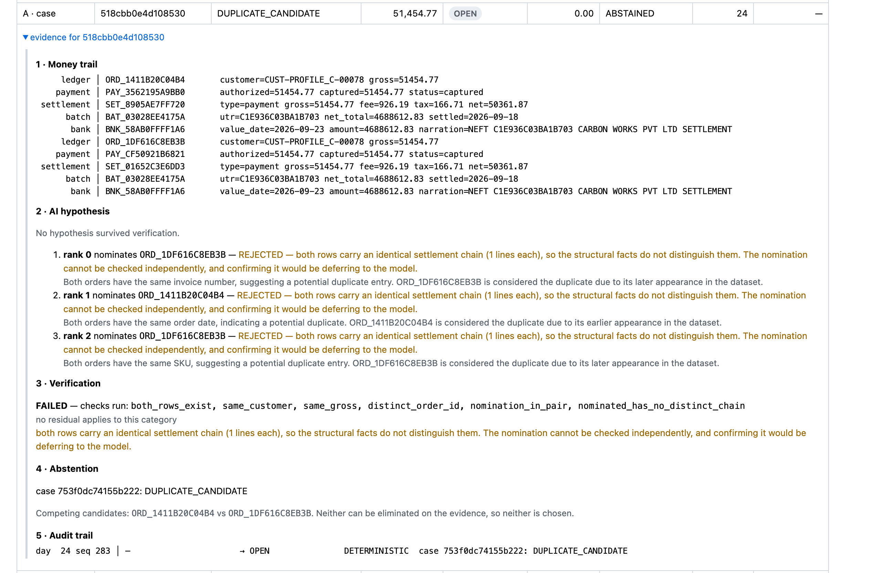

## Results

**Three sets, three different rules, reported separately and never blended.**
A single combined figure would hide which one the engine was built against.

| Set | Seeds | Rule |
|---|---|---|
| **Dev** | 42 | Run freely while building. Tuned against — an upper bound, not a generalisation claim. |
| **AI evaluation** | 1000–1019 | Results may be inspected and the hypothesis loop adjusted — *that is what it is for*. What may not change is **which seeds are in it**. The range was declared before M7 and is never revised. |
| **Holdout** | 999 | **Run ONCE, at the end.** Recorded whatever it says. |

The AI evaluation set is **not** a second holdout. Iterating against it is
permitted and expected; the pre-registration constrains set membership, not
whether the results are looked at. The holdout is the only set with a
look-once rule, and it is the only one whose number carries an
untuned-generalisation claim.

### Dev set — seed 42 (`make eval`)

Built against. Inspected freely throughout M2–M5. These numbers are tuned-on
and should be read as an upper bound, not as a generalisation claim.

`as_of=2026-11-30` · `calendar_v1` · `config_hash=12e9a009b59251d8`

| Population A — `ReconciliationCase` (n=5,026) | |
|---|---|
| Case match rate | **0.989654** |
| Deterministic residual | **52** |
| Residual false-match rate | **0.000000** |
| Gross-exposure match rate (₹ `expected_gross`) | 0.989100 |
| Expected-net cash reconciled (₹ `expected_net`) | ₹72,204,883.74 |
| Unresolved expected-net cash | ₹800,722.94 |
| Evidence coverage | 1.000000 |

| Population B — batch↔bank links (n=39 batches) | |
|---|---|
| Batch link rate | **0.948718** (37/39) |
| Batch false-link rate | **0.000000** |
| Injected noise recovered | 15/17 · 0.882353 (0.875000 excluding the known truth defect) |
| Category precision on unresolved batches | 1.000000 (2/2) |

| Population C — row-grain variances (n=29 rows) | |
|---|---|
| Recall | **1.000000** |
| Precision | **1.000000** |
| Value | ₹1,330,088.02 |

Population A divides by payment count, B by batch count, C by row count. They
are three denominators and are never averaged together; `batch_net_total` is
not comparable to case `expected_gross`.

**All 52 residuals are one half of an ambiguous duplicate pair** — 26 pairs,
both halves flagged, because the engine cannot know which was injected. That
is the entire surface M7 has to work on, and it is deliberately not resolved by
rules: guessing would trade a zero false-match rate for coverage.

**Baselines — no ranking claimed.** The naive baseline links *fewer* here, but
that is one run on one dataset and is reported, not concluded.

| Baseline | Linked | False links | |
|---|---|---|---|
| `naive` | 32 | 0 | amount + date window only, no identifiers |
| `deterministic_only` | 37 | 0 | P1–P9, no model calls |
| `settlesense` | 37 | 0 | identical until M7 lands; reported so the AI delta is visible later |
| `llm_only` | — | — | **not run** — needs a recorded fixture set; never falls back to the network |

**Analyst time is a derived estimate, not a measurement**, and is attributed
separately: 4,974 deterministic resolutions × 4 min = 19,896 min. The AI layer
has resolved 0. The two are never added.

### The evidence queue (`make ui-static`)

Read-only over the state DB. Three populations in one table with the population
named per row, sorted by amount, and a **Verified by** column that carries the
whole thesis at a glance.


**283 of 339 tracked exceptions say DETERMINISTIC.** The residual sequence
**3 → 6 → 2** rises before it falls, and the page says why rather than leaving
a reviewer to assume a bug: a residual is a queue, not a burn-down — day 12
delivers batches whose credit is still days away.

Every row expands into the full evidence, in the order a reviewer needs it:



That is one real duplicate pair. The money trail follows **both** halves
end to end (ledger → payment → settlement → batch → bank, identical on both
sides — which is exactly why it is ambiguous). Below it are gpt-4o's three
**real** ranked hypotheses, each rejected by name, and the abstention reason
that 480 of 507 decisions share:

> both rows carry an identical settlement chain (1 lines each), so the
> structural facts do not distinguish them. The nomination cannot be checked
> independently, and confirming it would be deferring to the model.

Rendered by [`reports/ui/queue.html`](reports/ui/queue.html); `make ui` serves
the same data through Streamlit. Both read one data layer, so the page and the
app cannot disagree.

### Throughput — dev seed (`make bench`)

`arm · 8 cores · 8 GiB · Python 3.14.7 · macOS-26.6-arm64`

Median of 3 repetitions, **never the best run**. No model calls. Full table in
[`reports/bench.md`](reports/bench.md).

| Records | Cases | Input rows | Pipeline (s) | Cases/s | Peak MiB |
|---:|---:|---:|---:|---:|---:|
| 500 | 502 | 1,626 | 0.040 | **12,581** | 1.8 |
| 5,000 | 5,026 | 15,779 | 0.330 | **15,233** | 19.4 |
| 25,000 | 25,123 | 78,594 | 1.927 | **13,035** | 94.9 |
| 100,000 | 100,506 | 313,869 | 8.525 | **11,790** | 379.7 |

Pipeline = ingest + engine; dataset generation is excluded from the timed
region and reported separately. 100k was **attempted and measured** because 25k
finished inside the two-minute budget that gates it — a skipped row would have
been absent, never extrapolated.

**Durations move between runs; nothing else does.** Across re-runs every count
above is bit-identical — cases, input rows, residuals, peak memory — while the
seconds and the rates derived from them vary by a few percent. That is the
expected shape: the pipeline is deterministic and the clock is not, which is
precisely why telemetry is a separate return value and never enters the result.
`tests/test_bench.py` cross-checks this table against `reports/bench.md` row by
row, so a stale README fails the suite rather than quietly misreporting.

**The residual share is the architectural argument.** The deterministic layer
carries the volume; the expensive stage is sized by ambiguity, not by rows:

| Records | Cases | Deterministic residual | Residual share |
|---:|---:|---:|---:|
| 500 | 502 | 4 | 0.80% |
| 5,000 | 5,026 | 52 | 1.03% |
| 25,000 | 25,123 | 246 | 0.98% |
| 100,000 | 100,506 | 1,012 | 1.01% |

Roughly one case in a hundred reaches the AI stage, and that ratio holds across
a 200-fold change in volume. **Seconds and rupees for that stage are not
reported here, because the BENCH calls no model** — it times the deterministic
pipeline. Real model cost is measured separately and reported below. A
`0.000s` row in this table would be indistinguishable from a stage that ran and
cost nothing.

Telemetry is a **separate return value** from the business result, not a field
inside it (SDD 8.1). `ReconciliationResult` contains no float, no duration and
no timestamp anywhere in its transitive type graph, so a golden comparator has
nothing to strip — and a test asserts the serialized result is byte-identical
with instrumentation on and off.

### AI layer — the verified hypothesis loop (`make eval-ai-loop`)

> **Of 507 duplicate-pair decisions the deterministic engine could not resolve,
> structural evidence exists for only 27. A real model (gpt-4o) nominated
> correctly on 33 of a 40-case sample and was confirmed on 20 of 20 where
> evidence existed, with zero false confirms. The remaining 480 have nothing to
> verify against — the two halves are structurally identical — and the system
> abstains, naming the check that failed.**

Both halves of that sentence matter and neither survives alone. The first is a
bound on the *data*: no model can be confirmed on a pair whose two rows are
indistinguishable, so 27 is a ceiling rather than a score. The second is what a
real model did inside that bound — and the fact that it was **rejected on the
other 20 of the sample, exactly as a perfect nominator is**, is the property the
architecture is for.

Measured across all **507 pre-registered decisions** (seeds 1000–1019) with
three stand-in clients and **no model calls at all**. Full table in
[`reports/ai/ai_loop.json`](reports/ai/ai_loop.json).

| Client | Nominates | Confirmed | |
|---|---|---:|---|
| **Oracle** | always the truth-correct row | **27 / 507** | the ceiling |
| **Adversarial** | always the *wrong* row | **0** | false confirms |
| **Silent** | nothing schema-valid | **0** | abstains, never crashes |

**27/507 is a ceiling, not a score.** No real model can exceed it: for the other
480 pairs the structural facts do not distinguish the two rows, so the verifier
rejects whatever is nominated. Reporting "the AI explained 5%" would report a
property of the *dataset* as though it were a property of a model.

**The adversarial zero is the safety result.** A verifier that rubber-stamped
would score identically on the oracle run — only an adversary that is always
wrong separates discrimination from deference. 480 decisions abstain with
`ALL_REJECTED`, and the reason names the check that failed.

Why the ceiling is so low is documented in [LIMITATIONS.md](LIMITATIONS.md):
the injected duplicate carries an invoice-number fingerprint that identifies it
perfectly and means nothing, and once that is excluded the two halves of a pair
are structurally identical.

**Provider:** OpenAI, pinned to the dated snapshot **`gpt-4o-2024-08-06`** —
never the moving `gpt-4o` alias, because a fixture recorded against an alias
cannot be reproduced once it repoints. `temperature=0`, `top_p=1`, `seed=42`.

**Determinism comes from the replay cache, not from the provider.** OpenAI
documents `seed` as best-effort. The provider settings reduce noise while
recording; the guarantee is the recorded response replayed byte for byte. The
provider is reachable from exactly one module, `eval/record_fixtures.py`, and
from nowhere in `settlesense/` at runtime.

### A real model in the loop — 40 recorded decisions

A stratified sample was recorded against the live provider: **20 the oracle
confirms, 20 it rejects**, chosen by a rule fixed in
`eval/record_fixtures.py` *before* any model was called, and stored in
`fixtures/llm_manifest.json` so the ordering is checkable. Scored in
[`reports/ai/real_model_sample.json`](reports/ai/real_model_sample.json).

| | |
|---|---|
| Produced a parseable hypothesis | **40 / 40** |
| Nominated one of the two rows | **40 / 40** |
| Decisive nomination correct | **33 / 40** |
| …its *top-ranked* guess | 24 / 40 |
| …on the confirmable stratum | **20 / 20** |
| Verifier confirmed — model | **20 / 40** |
| Verifier confirmed — oracle | 20 / 40 |
| **False confirms** | **0** |

**The model ties the oracle where evidence exists and is rejected everywhere
else.** On the 20 confirmable pairs it nominated correctly every time; on the
20 where the structural facts do not distinguish the rows, the verifier
rejected it — as it rejects a perfect nominator on those same pairs.

**Ranked hypotheses are not decoration.** The top-ranked guess is right 24/40,
but the nomination the verifier *acted on* is right 33/40 — because it tries
rank 0, 1, 2 in order and discards the ones that do not check out.

**Cost, MEASURED from the API response** (not estimated from prompt length):
24,996 input and 15,760 output tokens for 40 decisions =
**$0.220090 (₹19.37)**, about **₹2.49 per 1,000 rows**
against PDD 7.3's ₹50 ceiling.

### Held-out set — seed 999 (`make eval-holdout`)

**NOT YET RUN.** Reserved for a single run at the end, after M7. Whatever it
prints is what gets recorded here, including if it is worse. It also carries
the two withheld noise types (`garbled_narration`, `split_settlement`), which
the engine has never seen.

---

## Reproducing

```
make gen           # dev dataset,      seed 42
make gen-holdout   # held-out dataset, seed 999, includes withheld noise types
make eval          # all baselines against the DEV set (seed 42)
make eval-holdout  # the HELD-OUT set (seed 999) - run ONCE, at the end
make eval-set      # regenerate the AI evaluation set (seeds 1000-1019)
make bench         # throughput scaling table -> reports/bench.md
make test          # no network, deterministic, under 120 seconds
make check         # ruff + mypy + determinism guard tests
```

Targets that have no implementation yet refuse and exit non-zero. They never
pass silently.

## Generator independence

The adversarial generator was frozen at the commit recorded in
[`GENERATOR_MANIFEST.json`](GENERATOR_MANIFEST.json) **before engine development
began**. It is a separate code path: `gen/` imports nothing from `settlesense/`
and `settlesense/` imports nothing from `gen/`, enforced by an AST scan in both
directions. Rates, row types and the variance taxonomy are restated inside
`gen/` rather than shared, because a bug in a shared helper would cancel itself
out and the measurement would mean nothing.

Results reproduce with new seeds. Truth files carry `generator_commit: null` —
the hash cannot exist before the commit that creates it, and truth files are
never rewritten afterwards; the real hash lives only in the manifest.

The freeze is enforced, not just announced: the manifest records a content hash
of `gen/`, and `tests/test_generator_freeze.py` fails if that path changes.
Editing the generator after the freeze requires an explicit re-freeze with a
stated reason.

Two noise types — `garbled_narration` and `split_settlement` — are **withheld**
from engine tuning, gated behind `--include-withheld`, and reported separately
as the unknown-unknowns result.

## Modules built

Recorded here at submission: which Level 2 modules were built and which were
cut, without apology. Cutting a conditional module is a planned outcome, not
an incomplete submission.

## The AI evaluation set — declared before it was run

**Seeds 1000–1019 inclusive. All twenty. No seed will be excluded for any
reason discovered after generation.**

This section was written and committed BEFORE the twenty datasets were
generated, and before any result from them was seen. That ordering is the
whole point: a range chosen after inspecting per-seed outcomes is not an
evaluation set, it is a selection, and no amount of care afterwards can undo
the choice. Committing the declaration first is what makes the claim
checkable — `git log` shows this text predating the numbers.

| Seed range | Role | Used for |
|---|---|---|
| 42 | dev | Building M2–M5. Inspected freely. Tuned-on, so reported as an upper bound. |
| 999 | holdout | Includes the two withheld noise types. Run ONCE, at the end. Not yet run. |
| **1000–1019** | **AI evaluation** | **M7 onward. The measurement surface.** Results may be inspected and iterated against; the *membership* is frozen. |

**This set is not a second holdout.** Looking at its per-seed results and
adjusting the hypothesis loop is the intended use. The pre-registration below
constrains one thing only — which seeds are in it — because that is the choice
that cannot be audited after the fact. Everything else is open.

**Why twenty and why these.** The deterministic layer leaves one kind of work:
ambiguous duplicate pairs, ~26 per seed on the dev set. Twenty seeds gives
roughly 520 independent decisions — enough that a per-category accuracy figure
is not dominated by a handful of cases, and small enough to run inside a test
budget. The specific numbers 1000–1019 carry no meaning beyond being the next
round block after the dev and holdout seeds; they were fixed by writing them
here, not by trying alternatives.

**Pre-declared expectation.** Roughly 26 `DUPLICATE_CANDIDATE` pairs per seed,
so roughly 520 decisions in total. A seed producing a wildly different count
signals a noise rate interacting with something seed-dependent, and is a
finding to investigate — **not** grounds to drop the seed. If any seed is ever
excluded, the exclusion and its reason are recorded here in the same commit
that excludes it.

### What it turned out to be — measured after the declaration above

Recorded in a later commit than the declaration, deliberately, so the order is
visible in `git log`. Nothing here was used to revise anything above.

| | |
|---|---|
| Decisions (one per ambiguous pair) | **507** against a pre-declared ~520 |
| Cases flagged (both halves of each pair) | 1,014 |
| Pairs per seed | mean 25.35, range 18–34 |
| Seeds excluded | **0** |

**On stability.** "~26 ± a few" is not testable, because *a few* is not a
number. Duplicate pairs are rare independent events over ~5,000 chains, so the
count is Poisson-ish and its expected spread is √mean = 5.03. Observed spread
is 4.25 — a dispersion of **0.84×**, slightly *narrower* than chance alone
produces. The extremes sit at −1.46σ (seed 1005, 18 pairs) and +1.72σ (seed
1009, 34 pairs). No outlier, nothing to investigate.

**Two exact invariants hold on all twenty seeds**, and they are asserted:
`cases == 5000 + pairs` (each pair adds exactly one repeat purchase, hence one
new case) and `residual == 2 × pairs` (the engine flags both halves, because it
cannot know which was injected).

**A negative result worth stating.** Zero natural batch-amount collisions
across all twenty seeds — 780 batches. Path B's abstention rule therefore still
has never fired on generated data, and its 6-of-8 precision remains conditioned
on low batch density exactly as `LIMITATIONS.md` says. Twenty seeds agreeing
that collisions do not occur is *not* evidence that Path B handles them; it is
evidence that this generator cannot produce the case that would test it.

**Storage.** The twenty datasets are ~146MB and are NOT committed. They are
defined by (frozen generator commit, seed) and regenerate byte-identically;
`EVAL_SET_MANIFEST.json` records a content hash per seed, which is a
checkable claim rather than 2,880 files nobody will read. Regenerate with
`make eval-set`.

## Incremental state — what a multi-day run looks like

`make` has no target for this yet; `tests/test_store.py` drives it. Files arrive
day by day, exceptions open, wait for evidence, and confirm themselves when a
later day's bank file lands. `as_of` is derived from the arrival day, so a batch
whose credit is not yet due is **PENDING_EVIDENCE** rather than being reported as
a credit that never came.

**Population B residual at three checkpoints: 3 → 6 → 2.**

It rises before it falls, and that is correct. **A residual is a queue, not a
burn-down** — day 12 delivers batches whose credit is still days away, so
arrivals outpace departures in the middle of the run. A reviewer's instinct is
that residuals only shrink; the honest shape is the one above.

What must hold is the **endpoint**, and it does: after every file has arrived,
the incremental store holds exactly what a single-shot batch run reports, per
population and never summed — **A 52, B 2, C 2**. Two independent paths, one
answer. Every other test compares the store against itself; only that one could
say which of the two is wrong.

The dataset spans **24 delivery days, not 20** — `--days 20` is *capture* days,
and T+N settlement pushes the last rows out to day 24. Reconciling at day 20
leaves 557 Population A cases open, correctly: their settlement genuinely has
not been delivered. An incremental store that already knew about undelivered
rows would be reading the future.

## Limitations

See [LIMITATIONS.md](LIMITATIONS.md).
